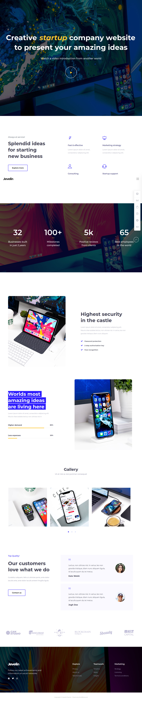
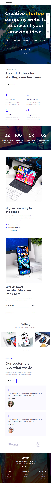
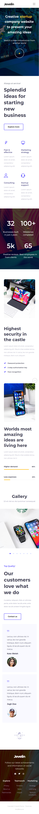

# Hypertext-Assassins

## Members name:

- *Mahmoud Mansour* [@GitHub](https://github.com/mahmodlte/)
- *Zeena Kareem* [@GitHub](https://github.com/ZeenaKareemAlhello)
- *Shadan Abdulkarim* [@GitHub](https://github.com/shadan72/)
- *Ahmad Duhoki* [@GitHub](https://github.com/AhmadDuhoki)

## The URL of the design:

The URL of the our design is called [Startup-Creative](https://jevelin.shufflehound.com/startup-creative/).

## ScreenShots of the project.

### Desktop Design

### Tablet Design

### Mobile Version Design

## The Framework:

#### We have planned to use **Bootstrap 4** Framework.

## The part of the website that we planned to be done by May 5th:

 We will separate the website into two parts each part three sections we will deliver the first part by 5th of may and the full version on 8th of may (Friday) The First part of the website:
- The first part is Showcase part *Mahmoud Mansour*
- Splendid ideas for starting new business part *Zeena Abdalkareem*
- Counters part *Shadan Abdulkareem*
- Highest security in the castle and Worlds most amazing ideas are living here part *Ahmed Duhoki*

## part one is completed on the deadline and you can comment and add your feedback 

### The Second part of the website

### Updated version of Readme after 5th of may 

The second part of the website
- Gallery Part *Shadan Abulkareem*
- Customers part *Zeena Abdalkareem*
- testimonial menu *Ahmed Duhoki*
- last section and footer *Mahmoud Mansour*
## those parts will be delivered by 8th of May (Friday)